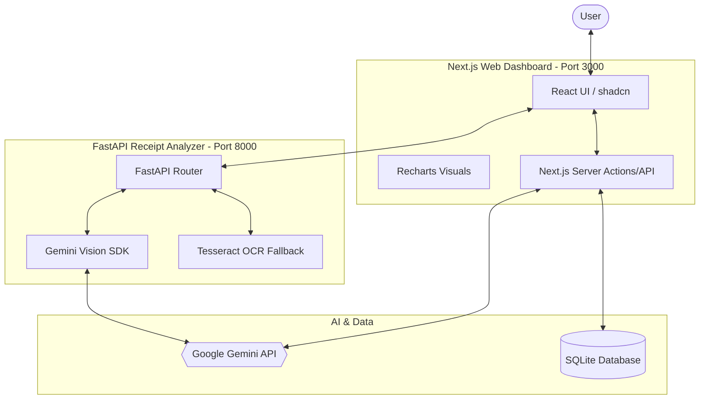

# 🏗️ System Design Architecture

## Overview
FinoSpark AI is built on a decoupled architecture consisting of a modern Next.js frontend, a high-performance Python FastAPI vision service, and a data layer powered by SQLite and Google Gemini.

## 🗺️ High-Level Architecture

## 🏗️ Core Components

### 1. Frontend (Next.js 15)
- **Framework:** Next.js (App Router) using TypeScript.
- **UI:** Tailwind CSS v4, shadcn/ui, and Framer Motion for animations.
- **State Management:** React Hooks and Server Actions.
- **Visualizations:** Recharts for financial trend analysis and category breakdowns.

### 2. Vision Backend (FastAPI)
- **Purpose:** Specifically handles image processing and receipt data extraction.
- **Primary Extraction:** Uses **Google Gemini 1.5 Pro/Flash** for vision-to-json mapping.
- **Secondary Extraction:** **Tesseract OCR** fallback for low-quality images or offline processing logic.
- **Interface:** RESTful API endpoints for image upload and sample retrieval.

### 3. AI Intelligence Layer
- **Financial Advisor:** A specialized prompt-engineered Gemini agent that provides spending summaries, budget advice, and investment goal tracking.
- **Chat System:** real-time interaction with financial data context.

### 4. Data Layer
- **Primary DB:** SQLite - A lightweight, file-based relational database for storing user accounts, transactions, and investment plans.
- **File System:** Local storage for receipt samples and temporary image processing.

## 🔄 Data Flow

1.  **Receipt Analysis:**
    *   User uploads image via `FileDropZone`.
    *   Frontend sends image to FastAPI (`/analyze`).
    *   FastAPI processes via Gemini Vision.
    *   Structured JSON is returned to the Frontend and displayed.
2.  **Financial Insights:**
    *   Dashboard requests spending data from Next.js API.
    *   API fetches from SQLite and sends raw data + context to Gemini.
    *   Gemini returns a "Natural Language Digest" which is displayed in the UI.

## 🛠️ Tech Stack Table

| Layer | Technology |
| :--- | :--- |
| **Web UI** | Next.js 15 (React 19), TypeScript |
| **Styling** | Tailwind CSS v4, Lucide |
| **Data Viz** | Recharts |
| **Vision API** | FastAPI (Python 3.12+) |
| **Core AI** | Google Gemini SDK |
| **Database** | SQLite (Prisma/Better-SQLite3) |
| **OCR** | Tesseract.js / PyTesseract |
